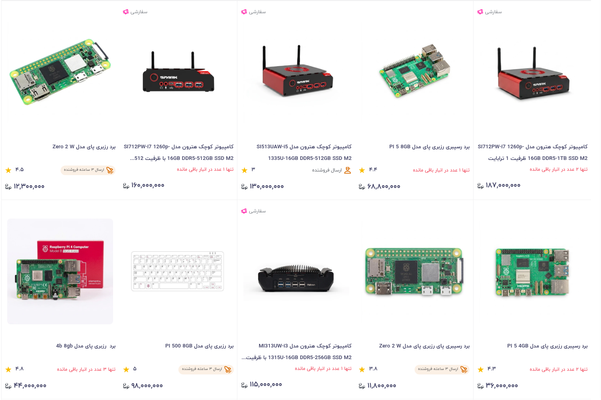
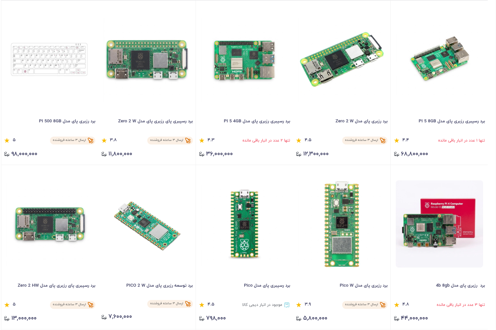

# پاک‌ساز محصولات سفارشی دیجی‌کالا

> افزونه‌ای مستقل برای مخفی‌کردن محلی محصولات تبلیغاتی دارای برچسب «سفارشی» در فهرست‌ها و نتایج جست‌وجوی دیجی‌کالا.


این افزونه محصولات سفارشی را پیش از ساخته‌شدن ردیف‌های فهرست از Request جست‌وجو کنار می‌گذارد؛ بنابراین محصولات عادی به‌طور پیوسته چیده می‌شوند و تبلیغ‌های مزاحم و زیاد دارای برچسب «سفارشی» مزاحم جستجوی شما در دیجی‌کالا نمی‌شود. (واقعا این موضوع برای خودم اعصاب خوردکن بود.)

> [!IMPORTANT]
> این یک پروژهٔ مستقل و غیررسمی است و هیچ وابستگی, تأیید یا حمایت رسمی از سوی دیجی‌کالا ندارد.

## قابلیت‌ها

- حذف Local محصولات «سفارشی» از نتایج جست‌وجو و صفحات فهرست.
- سازگار با بارگذاری پیوسته و نتایج پویای سایت.
- تشخیص تبلیغات از ساختار Request response جست‌وجو (`properties.is_ad`) و لایهٔ پشتیبان DOM.
- کلید روشن/خاموش در پنجرهٔ افزونه.
- بازسازی خودکار صفحه هنگام تغییر وضعیت فیلتر.
- بدون تبلیغات, لینک همکاری در فروش, تحلیل رفتاری یا انتقال داده.

## عملکرد افزونه

| افزونه خاموش | افزونه روشن |
| --- | --- |
|  |  |

با فعال‌شدن افزونه, محصولات دارای برچسب «سفارشی» از فهرست نتایج حذف می‌شوند و محصولات عادی بدون ایجاد فضای خالی دوباره در کنار یکدیگر قرار می‌گیرند.
## نصب دستی در Chrome یا Chromium

1. از صفحهٔ [آخرین نسخهٔ منتشرشده](https://github.com/zoh-li/digikala-sponsored-cleaner/releases/latest), جدیدترین نسخهٔ افزونه را دریافت کنید.
2. فایل `digikala-sponsored-cleaner-vX.X.X.zip` را از قسمت **Assets** همان Release دانلود کنید.
3. فایل ZIP دانلودشده را Extract کنید.
4. در نوار نشانی مرورگر, `chrome://extensions` را باز کنید.
5. گزینهٔ **Developer mode** را فعال کنید.
6. روی **Load unpacked** کلیک کنید.
7. پوشهٔ استخراج‌شده‌ای را انتخاب کنید که فایل `manifest.json` مستقیماً داخل آن قرار دارد.
8. یکی از صفحات باز دیجی‌کالا را Refresh کنید.

> [!TIP]
> برای استفادهٔ معمول, نسخهٔ موجود در **Releases** را دانلود کنید. Clone کردن مخزن برای توسعه, بررسی کد یا مشارکت در پروژه مناسب‌تر است.

## استفاده

افزونه به‌صورت پیش‌فرض فعال است. در صفحه‌های جست‌وجو یا فهرست دیجی‌کالا, محصولات سفارشی خودکار از نتایج کنار گذاشته می‌شوند. با کلیک روی آیکون افزونه می‌توانید فیلتر را موقتاً روشن یا خاموش کنید؛ صفحه پس از تغییر وضعیت دوباره بارگذاری می‌شود تا نتیجهٔ درست نمایش داده شود.

## حریم خصوصی

این افزونه:

- هیچ دادهٔ شخصی, تاریخچهٔ مرور, اطلاعات ورود یا اطلاعات پرداخت را جمع‌آوری نمی‌کند.
- هیچ اطلاعاتی را به سرور یا شخص ثالث ارسال نمی‌کند.
- فقط یک مقدار روشن/خاموش را به‌صورت محلی نگه می‌دارد؛ این مقدار ممکن است برای اعمال سریع تنظیم در بارگذاری بعدی, در فضای محلی همان دامنه نیز منعکس شود.
- فقط روی دامنه‌های دیجی‌کالا اجرا می‌شود.

متن کامل در [PRIVACY.md](PRIVACY.md) قرار دارد.

## محدوده و محدودیت‌ها

این پروژه صرفاً نحوهٔ نمایش نتایج در مرورگر کاربر را شخصی‌سازی می‌کند و هیچ تغییری در حساب کاربری, سفارش, پرداخت یا زیرساخت دیجی‌کالا ایجاد نمی‌کند. به‌دلیل تغییرات احتمالی در ساختار سایت یا API, ممکن است در آینده به به‌روزرسانی نیاز داشته باشد.

نام‌ها و نشان‌های تجاری «دیجی‌کالا» متعلق به مالکان مربوطه هستند. در انتشار یا معرفی این پروژه, آن را رسمی یا مورد تأیید دیجی‌کالا معرفی نکنید.

## توسعهٔ محلی

این پروژه وابستگی ساخت ندارد. پس از هر تغییر, از صفحهٔ `chrome://extensions` روی دکمهٔ بازبارگذاری افزونه کلیک کنید و سپس صفحهٔ دیجی‌کالا را رفرش کنید.

بررسی‌های پایه:

```bash
node --check content.js
node --check page-interceptor.js
node --check popup.js
```

## مشارکت

گزارش باگ, پیشنهاد و Pull Request خوش‌آمد است. لطفاً در گزارش باگ, نشانی صفحهٔ دیجی‌کالا, رفتار مورد انتظار و یک تصویر یا مراحل بازتولید را اضافه کنید؛ هرگز اطلاعات شخصی, کوکی یا دادهٔ حساب خود را منتشر نکنید.

## سلب مسئولیت
این پروژه مستقل و غیررسمی است و هیچ‌گونه وابستگی, همکاری, تأیید یا ارتباط رسمی با دیجی‌کالا ندارد. تمامی نام‌ها و علائم تجاری متعلق به صاحبان مربوطه هستند. این افزونه صرفاً نحوهٔ نمایش محتوا را در سمت کاربر و در مرورگر وی تغییر می‌دهد. مسئولیت نصب و استفاده از افزونه و رعایت قوانین و شرایط سرویس‌های مربوطه بر عهدهٔ کاربر است.

## لایسنس

این پروژه تحت [MIT License](LICENSE) منتشر می‌شود.
